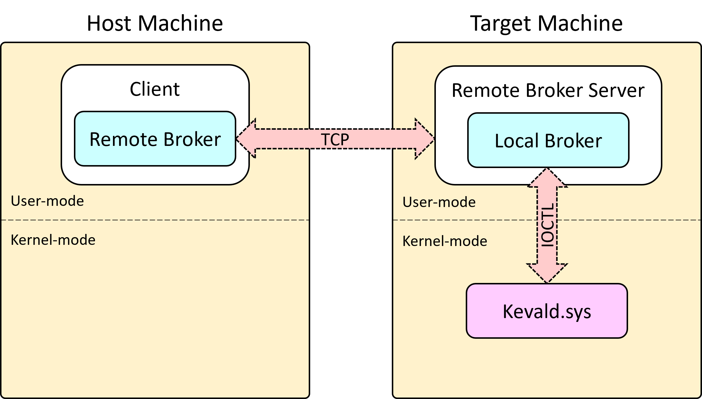

# Keval

Keval allows you to call arbitrary Windows kernel-mode functions from user mode, even (and primarily) on another machine. 

The user mode portion is written in Python, which allows you to quickly declare, call, and inspect the results of a kernel function without compiling anything again.

## Example

```python
import ctypes

from pykeval.frontend import Client
from pykeval.broker import RemoteBroker


class UNICODE_STRING(ctypes.Structure):
    _fields_ = [
        ("Length", ctypes.c_ushort),
        ("MaximumLength", ctypes.c_ushort),
        ("Buffer", ctypes.c_wchar_p)
    ]


client = Client(RemoteBroker("192.168.233.156"))
temp = UNICODE_STRING()

# We declare the signature of `RtlInitUnicodeString` like we'd do in a C header. Note that we don't actually
# need to declare `struct UNICODE_STRING` because we're passing a pointer.
client.declare("ntoskrnl",
               "void RtlInitUnicodeString(UNICODE_STRING* DestinationString, wchar_t* SourceString);")

return_value, args, allocations = client.ex_call("ntoskrnl",
                                                 "RtlInitUnicodeString",
                                                 ctypes.pointer(temp),  # This is an out param
                                                 "Hello\0".encode("UTF-16LE"),
                                                 read_back_args=True)

# We don't need the allocations that were made during this call since we read back the arguments.
for allocation in allocations:
    allocation.free()
# BrokerAllocation objects are also garbage-collected by Python, but it's best not to rely on that.

out_param = args[0]
# The type of `out_param` has the same fields as `UNICODE_STRING` but `Buffer` was converted to a type
# compatible with the broker's machine (in case of a 64-bit machine, `c_uint64`).
# Since read_back_args=True, the returned argument is the *value* of the pointer after the call.
assert "Hello" == client.read_wstring(out_param.Buffer)

```

## How it works

`kevald.sys` is a driver that accepts requests to run kernel functions over IOCTL. Each request contains the signature of the function, and so the driver calls it appropriately.

`pykeval` is a python package that, in the end, passes the correct requests to the driver. It contains:

* `Client`: The main interface through which the library is used.
* Brokers: Responsible to pass the request to the driver
  * `LocalBroker`: Passes the request to the driver via IOCTL.
  * `RemoteBroker`: Passes the request to a `RemoteBrokerServer` (over TCP) which delegates the request to another broker. This is used when running code on another machine.

It's possible to run code both on the local machine or a remote machine by replacing the type of broker the client uses. When using a remote broker, the setup looks like this:



## Getting started

See [Getting started](docs/getting_started.md)

## TODO:

- [ ] Predefine common Windows types in the client (`BYTE`, `DWORD`, `PVOID`) so declarations can be a simpler copy-paste.

- [ ] Allow uploading and installing the driver directly from the client.

- [ ] Add Github CI/CD to compile `kevald.sys` and publish `pyekval` to PyPI.

- [ ] More logs, an option for verbose logging.

#### Won't do:

- [ ] Support structs as parameters/return values. There seems to be no use case, as most if not all kernel functions use pointers when passing structures.

## Acknowledgements

This project wouldn't be possible without:

* [The LLVM Project](https://github.com/llvm/llvm-project), specifically libclang
* [libffi](https://github.com/libffi/libffi), specifically [@am11's fork](https://github.com/am11/libffi) which makes it _much_ easier to build under Windows.
* [stlkrn](https://github.com/jxy-s/stlkrn) and [vcrtl](https://github.com/avakar/vcrtl)

